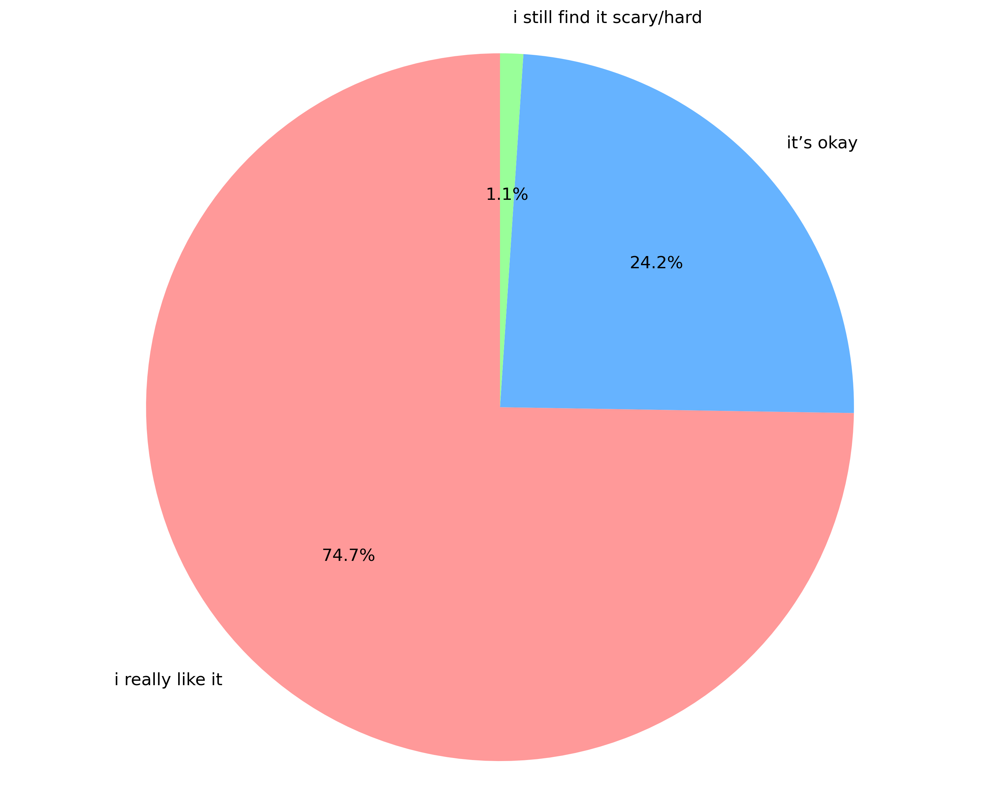
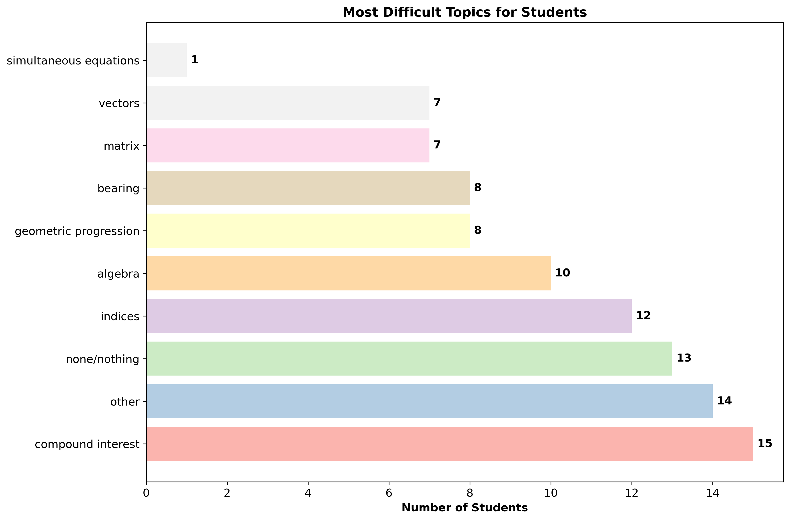

# Christad-Foundation-summer-camp-impact-analysis
# Summer Camp Math Program: Impact Analysis

## Project Overview
This project analyzes the impact of a summer camp math program run by the CHRISTAD Foundation. The analysis is based on survey responses from 95 participants and aims to measure changes in student attitudes, confidence, and engagement with mathematics. The goal was to validate the program's success and identify areas for future improvement.

The analysis complements the official report.

**Note on Data Privacy:** The original survey data contains personally identifiable information (PII) and therefore **cannot be shared publicly**. This repository focuses on showcasing the analysis methodology, code, and visualized results.

## Key Insights & Impact (Summary)

The data reveals the program was a significant success:
*   **Mindset Shift:** **74.7%** of students reported they "really like" math after the camp.
*   **Confidence Boost:** Over **52%** of students felt "Very confident" in solving math problems.
*   **Teacher Excellence:** **98.9%** of students found the teachers "very helpful and easy to learn from."
*   **Word of Mouth:** The camp achieved a **93.5%** recommendation rate.
*   **Real-World Application:** **86%** of students used something they learned outside the classroom.

*For a full list of insights, please view the Complete report.*

##  Dashboard of Findings

### Student Sentiment & Confidence
| | |
| :---: | :---: |
| **Post-Camp Math Sentiment** | **Confidence in Math Problem-Solving** |
|  |  |

### What Worked & What Was Challenging
| | |
| :---: | :---: |
| **Most Popular Difficult Topics** | 
|  |

*For more visualizations, see the complete set in the outputs folder.*

## Technical Implementation & Code Showcase

### Tools & Libraries
*   **Language:** Python
*   **Libraries:** Pandas, NumPy, Matplotlib, Seaborn
*   **Data Processing:** Cleaning, categorization, and analysis of survey data.
*   **Visualization:** Creation of informative and publication-ready charts and graphs.

### Analysis Steps (Demonstrated in Code)
The  notebook walks through the entire analytical process:
1.  **Data Loading & Cleaning:** Standardized age groups, cleaned free-text responses, and mapped confidence levels.
2.  **Topic Extraction:** Engineered keywords to categorize fun and difficult topics from open-ended responses (See code snippet below).
3.  **Statistical Analysis & Visualization:** Generated a suite of plots to illustrate key program metrics and findings.

How to Explore This Project

**Note:** The original survey data is private to protect participant confidentiality and is not included in this repository. This project focuses on showcasing the analytical methodology and results.

1.  **Review the Analysis Code:** Open notebooks to see the complete data processing pipeline, including:
    *   Data cleaning and standardization procedures.
    *   Logic for categorizing free-text responses.
    *   Code for generating the visualizations.
2.  **See the Final Visualizations:** The outputs folder contains all the charts and graphs that summarize the camp's impact. These are the final products of the analysis.
3.  **Contextualize the Findings:** The reports folder contains the original impact report that this analysis supports.

4.  Conclusion
This analysis quantitatively confirms the resounding success of the CHRISTAD Foundation's summer camp. The program effectively transformed students' perceptions of math, built tangible confidence, and was delivered by a highly praised teaching team. The insights generated especially regarding difficult topics and learning preferences provide a clear data-driven roadmap for making an already excellent program even more impactful next year.
